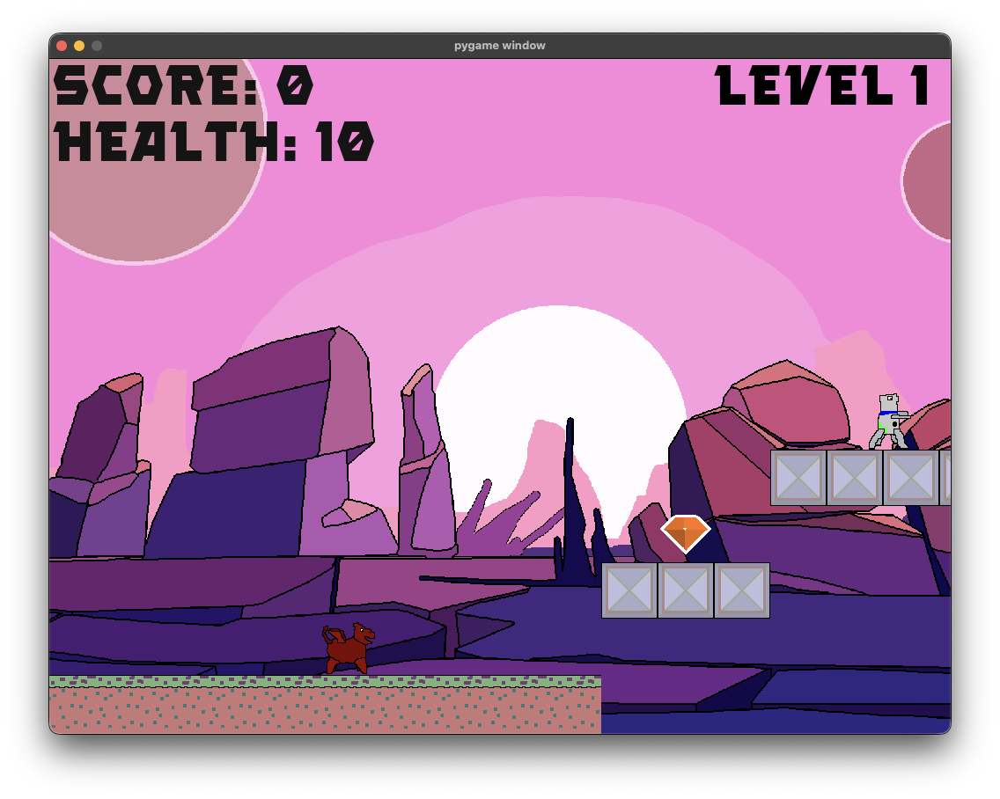
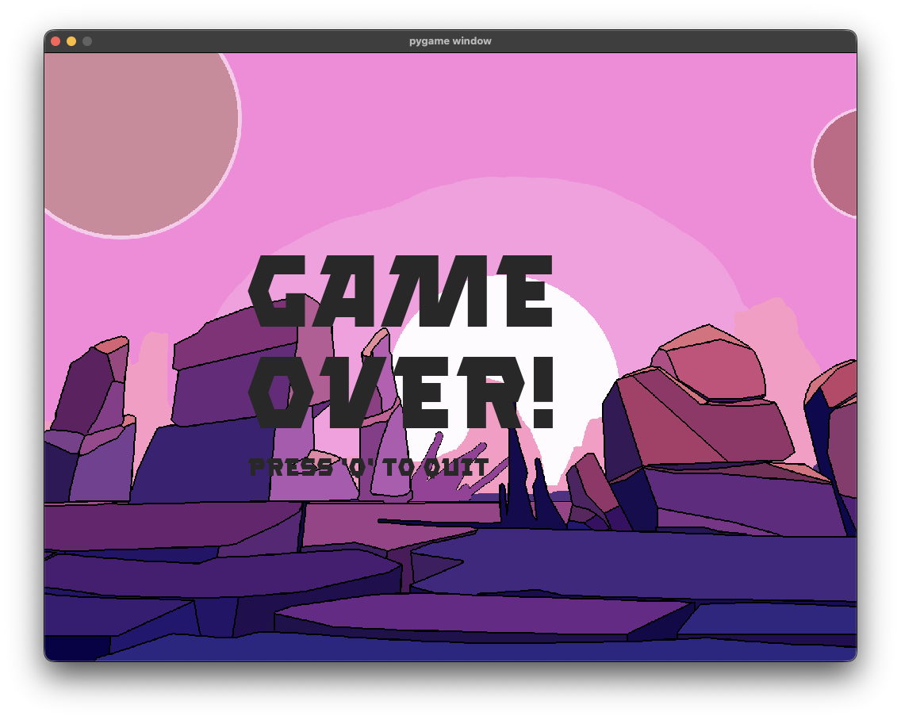

# Platform Game

[![Python][python-badge]][python]
[![GitHub][github-badge]][github]
[![uv][uv-badge]][uv]
[![Ruff][ruff-badge]][ruff]
[![GitHub Actions][github-actions-badge]][github-actions]
[![Lint][lint-badge]][lint]
[![Gimp][gimp-badge]][gimp]
[![License: MIT][license-badge]][license]
[![Buy Me A Coffee][buy-me-a-coffee-badge]][buy-me-a-coffee]
[![No AI][noai-badge]][website]

Prototype platformer game created in Python created using [Pygame][pygame].

The game implements most major features of a standard platformer:

- Jumping
- Enemies
- Collectables
- An attack
- Limited health
- Falling

Colliding with an enemy or falling will cause the level to restart. If the player health reaches zero, the game over screen is displayed.

The level is complete once the final gem is collected. Currently only a single level is implemented, so this also ends the game.

## Controls

Keyboard controls:

- Toggle sound - 'm'
- Moved left - left arrow or 'a'
- Moved right - right arrow or 'd'
- Jump - up arrow or 'w'
- Ranged attack - space
- Quit 'q' or esc
- Toggle  input - 'i' (disables keyboard input for movement)

Mouse/trackpad controls (movement only):

- Move left/right - move left/right on mouse/trackpad
- Jump - Click

When mouse/trackpad input is on, the corresponding keyboard controls are disabled. However, the other controls are always active.

<!-- Badges -->

[python-badge]: https://img.shields.io/badge/Python-3776AB?logo=python&logoColor=fff&style=for-the-badge
[github-badge]: https://img.shields.io/badge/GitHub-%23121011.svg?logo=github&logoColor=white&style=for-the-badge
[uv-badge]: https://img.shields.io/badge/uv-%23DE5FE9.svg?style=for-the-badge&logo=uv&logoColor=white
[license-badge]: https://img.shields.io/github/license/zwill22/iosbuild?style=for-the-badge
[github-actions-badge]: https://img.shields.io/badge/GitHub_Actions-2088FF?logo=github-actions&logoColor=white&style=for-the-badge
[lint-badge]: https://img.shields.io/github/actions/workflow/status/zwill22/games/lint.yml?style=for-the-badge&logo=github
[buy-me-a-coffee-badge]: https://img.shields.io/badge/Buy%20Me%20a%20Coffee-ffdd00?&logo=buy-me-a-coffee&logoColor=black&style=for-the-badge
[noai-badge]: https://custom-icon-badges.demolab.com/badge/No%20AI-2f2f2f?logo=non-ai&logoColor=white&style=for-the-badge
[ruff-badge]: https://custom-icon-badges.demolab.com/badge/Ruff-261230.svg?logo=ruff-logo&style=for-the-badge
[gimp-badge]: https://img.shields.io/badge/Gimp-657D8B?style=for-the-badge&logo=gimp&logoColor=FFFFFF

<!-- Links -->

[python]: https://www.python.org
[github]: https://github.com/zwill22/games
[license]: https://github.com/zwill22/games/blob/main/LICENSE
[github-actions]: https://github.com/zwill22/games/actions
[buy-me-a-coffee]: https://coff.ee/zmwill
[uv]: https://docs.astral.sh/uv/
[ruff]: https://docs.astral.sh/ruff/
[website]: https://zmwill.uk
[lint]: https://github.com/zwill22/games/actions/workflows/lint.yml
[pygame]: https://www.pygame.org
[gimp]: https://www.gimp.org/
